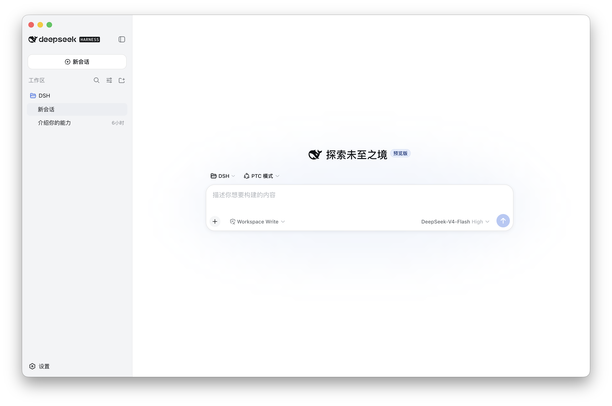
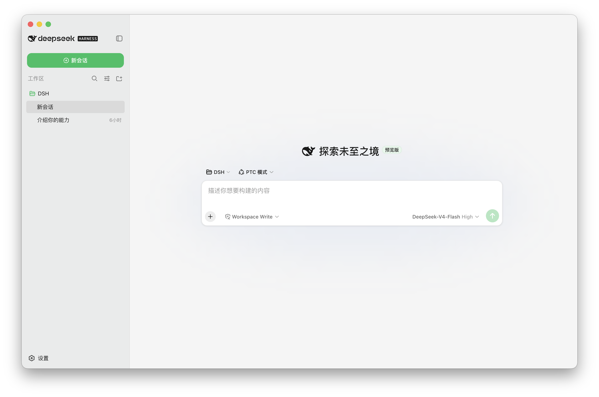
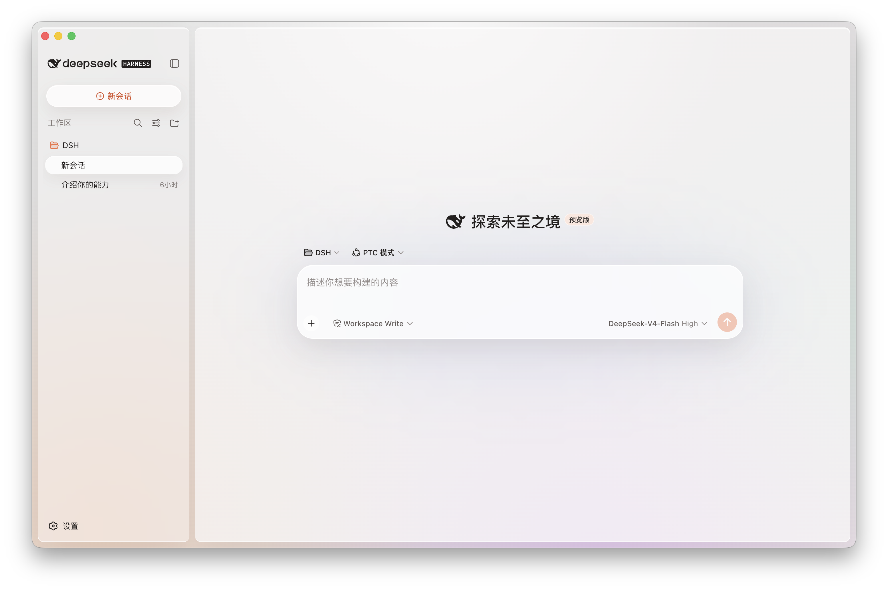
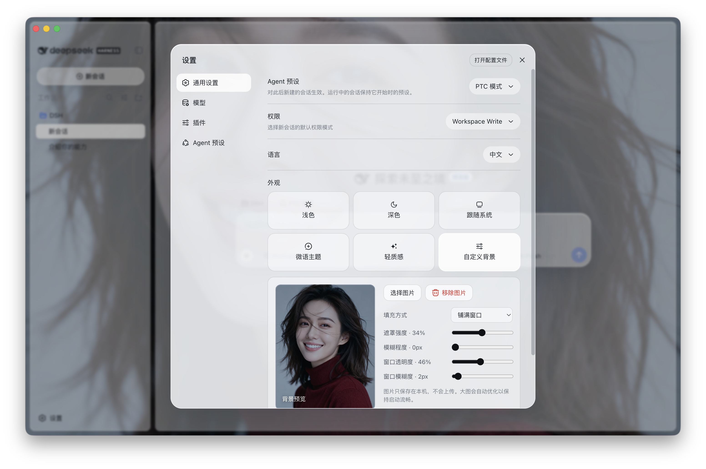

<div align="center">

# DSH Desktop

**A ready-to-use desktop edition of the official DeepSeek Harness.**

No Node.js installation. No command line. No manual runtime setup.

English | [中文](README.zh.md)

[](https://github.com/limileo/DSH-Desktop/actions/workflows/desktop-portable.yml) [](https://github.com/limileo/DSH-Desktop/releases) [](LICENSE)

</div>

DSH Desktop packages the official [DeepSeek Harness](https://github.com/deepseek-ai/deepseek-harness) Host, Web UI, and runtime into a native desktop carrier for macOS and Windows. Install it, open it, and start working.

> DSH Desktop is an unofficial community project. It is not an official DeepSeek product or distribution channel.

## Download

| Platform | Installer | Notes |
| --- | --- | --- |
| macOS Apple Silicon | [**Download DMG**](https://github.com/limileo/DSH-Desktop/releases/latest/download/DSH-Desktop-macOS.dmg) | Signed and notarized by Apple |
| Windows x64 | [**Download EXE**](https://github.com/limileo/DSH-Desktop/releases/latest/download/DSH-Desktop-Windows.exe) | Standard NSIS installer |

Both installers include the complete runtime. Users do not need to install Node.js, pnpm, or any command-line tools.

Windows builds are currently unsigned and may trigger a Microsoft Defender SmartScreen warning. Choose **More info → Run anyway** to continue.

## Preview

<p align="center">
  
</p>

## Highlights

- One-click desktop launch with no environment setup
- Complete official Harness Host, Web UI, and runtime bundled locally
- Native window lifecycle and system-tray Host supervision
- Local sessions and local service execution
- macOS Developer ID signing, Hardened Runtime, Apple notarization, and stapled tickets
- Native macOS DMG and Windows NSIS installers verified through real launch tests
- Four carefully adapted themes: Default, Dark, Soft Chat, and Light Texture
- Custom image backgrounds with fill mode, overlay, image blur, window opacity, and window blur controls
- Desktop-specific fixes for sidebar collapse, settings layout, conversation switching, and running states
- Scheduled upstream checks that prepare reviewable synchronization changes from the official project

## Themes

### Soft Chat and Light Texture

<table>
  <tr>
    <td width="50%"></td>
    <td width="50%"></td>
  </tr>
  <tr>
    <td align="center"><strong>Soft Chat</strong></td>
    <td align="center"><strong>Light Texture</strong></td>
  </tr>
</table>

### Custom background

Use any local image as the application background and tune the surface independently from the image.

<p align="center">
  
</p>

The selected image stays on the local machine and is never uploaded by the theme feature.

<p align="center">
  
</p>

## Run

### macOS

1. Download `DSH-Desktop-macOS.dmg`.
2. Open the DMG.
3. Drag **DSH Desktop** into **Applications**.
4. Open DSH Desktop from Applications.

The distributed DMG and application are signed with a Developer ID Application certificate, notarized by Apple, and carry stapled notarization tickets.

### Windows

1. Download `DSH-Desktop-Windows.exe`.
2. Run the installer and choose an installation directory.
3. Launch DSH Desktop from the Start menu or desktop shortcut.

## How it relates to the official project

Harness core behavior, plugins, agent capabilities, and the Web UI come from [deepseek-ai/deepseek-harness](https://github.com/deepseek-ai/deepseek-harness). This repository maintains the desktop carrier, platform integration, theme adaptations, installers, and cross-platform validation on top of that source.

The desktop application does not silently replace its own program files. Updated installers are published through [GitHub Releases](https://github.com/limileo/DSH-Desktop/releases), while the upstream synchronization workflow keeps official changes reviewable before distribution.

## Run from source

Development requires Node.js 22.23.2 and pnpm. The desktop entry is located in `apps/desktop`.

```sh
pnpm install
pnpm run dev:desktop
```

Build an unsigned installer for the current operating system:

```sh
pnpm run dist:desktop:unsigned
```

See [`apps/desktop/README.md`](apps/desktop/README.md) for architecture, packaging, signing, and release details.

## Contributing

Use [Issues](https://github.com/limileo/DSH-Desktop/issues) for desktop-specific problems and Pull Requests for improvements. For Harness core behavior and plugin development, also consult the official project.

## License

[MIT](LICENSE). The original copyright notice remains intact. Desktop modifications are described in [NOTICE](NOTICE), and third-party dependency notices are available in [THIRD_PARTY_NOTICES.md](THIRD_PARTY_NOTICES.md).
