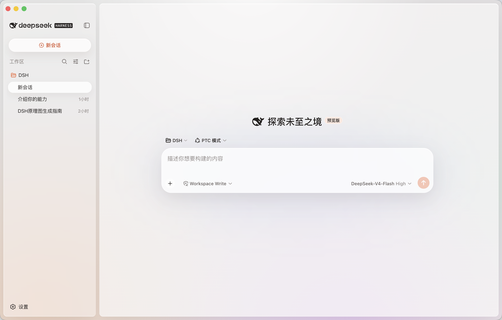

# DSH Desktop

[English](README.md) | 中文

基于官方 [DeepSeek Harness](https://github.com/deepseek-ai/deepseek-harness) 的开箱即用桌面版本。打开安装包即可使用，无需另外安装 Node.js、执行命令或手动配置运行环境。

> DSH Desktop 是非官方社区项目，不代表 DeepSeek 官方产品或发布渠道。

## 下载与安装

请从本仓库的 [GitHub Releases](https://github.com/limileo/DSH-Desktop/releases) 下载最新版。

| 平台 | 安装包 | 支持情况 |
| --- | --- | --- |
| macOS Apple Silicon | `DSH-Desktop-macOS-arm64-*.dmg` | 支持 |
| Windows x64 | `DSH-Desktop-Windows-x64-Setup-*.exe` | 支持 |
| macOS Intel | — | 计划支持 |

macOS：打开 DMG，将 `DSH Desktop` 拖入 `Applications`。正式发布的 DMG 使用 Developer ID Application 证书签名，已通过 Apple 公证并装订公证票据。

Windows：双击 Setup 安装包并按向导安装。当前社区构建未购买代码签名证书，Windows SmartScreen 可能显示“未知发布者”，可选择“更多信息”后继续运行。

Windows 提示来自操作系统的发布者校验。两个安装包都内置完整运行环境，不需要用户再安装依赖。

## 界面预览

<p align="center">
  
</p>

## 桌面版能力

- 内置官方 Harness Host、Web UI 与运行依赖，安装后直接启动
- 自动管理本地 Host 生命周期，无需命令行
- 关闭窗口后驻留系统托盘，可恢复窗口或完整退出
- 会话数据和服务保留在本地运行
- 外部网页交给系统浏览器打开，并限制应用内导航来源
- 提供原生、深色、微语主题与轻质感主题
- 针对 macOS 和 Windows 调整窗口、标题栏、圆角与侧栏布局
- macOS 正式版本启用 Developer ID 签名、Hardened Runtime、Apple 公证与票据装订
- macOS DMG 与 Windows NSIS 安装包均经过实际安装启动检查

## 与官方项目的关系

Harness 核心、插件系统、Agent 能力和 Web UI 来自 [deepseek-ai/deepseek-harness](https://github.com/deepseek-ai/deepseek-harness)。本仓库在官方源码之上维护桌面层、主题适配、安装包和跨平台验证。

`.github/workflows/desktop-portable.yml` 在 macOS 与 Windows 原生 Runner 上构建安装包。定时或手动构建会先尝试合并官方 `master`；若桌面改动与上游冲突，工作流会直接失败，避免发布未经验证的自动合并结果。

已经安装的桌面应用目前不会在后台自行替换程序文件。新版本由 GitHub Releases 发布，用户按需下载安装。macOS 正式版本已经签名并公证；Windows 版本仍未签名，可能继续触发 SmartScreen。

## 从源码开发

要求 Node.js 22.23.2 与 pnpm。桌面入口位于 `apps/desktop`。

```sh
pnpm install
pnpm run dev:desktop
```

生成当前系统的未签名安装包：

```sh
pnpm run dist:desktop:unsigned
```

macOS 生成 DMG，Windows 生成 NSIS Setup EXE。更完整的桌面架构与签名发布说明见 [`apps/desktop/README.md`](apps/desktop/README.md)。

## 参与贡献

欢迎通过 [Issues](https://github.com/limileo/DSH-Desktop/issues) 报告桌面端问题，并通过 Pull Request 提交改进。Harness 核心问题与插件开发请同时参考官方仓库的贡献指南。

## License

[MIT](LICENSE)。原项目版权声明继续保留，桌面端修改说明见 [NOTICE](NOTICE)。第三方依赖信息见 [THIRD_PARTY_NOTICES.md](THIRD_PARTY_NOTICES.md)。
